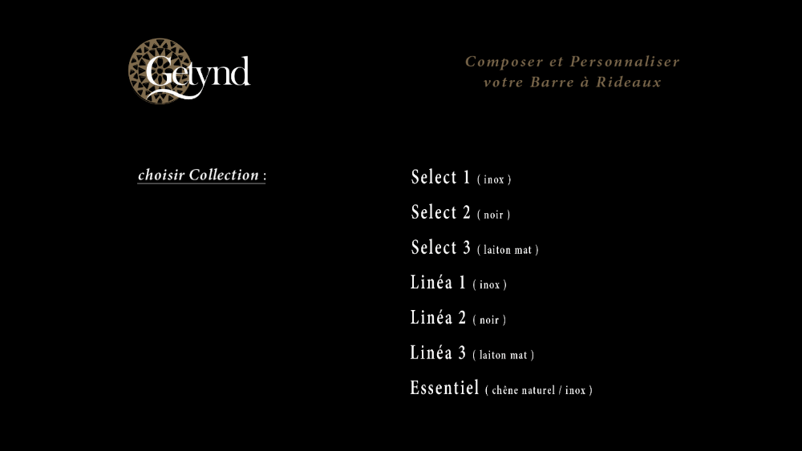
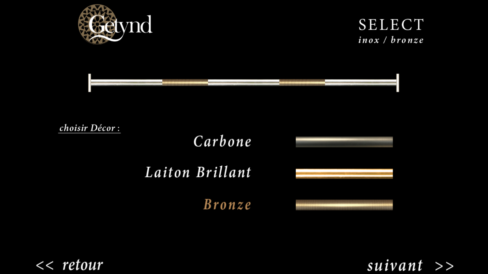
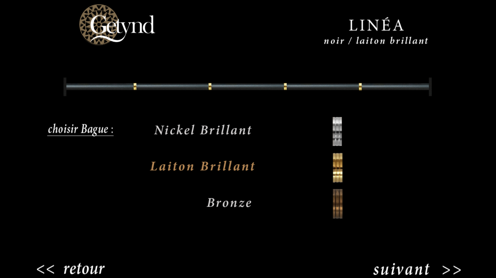
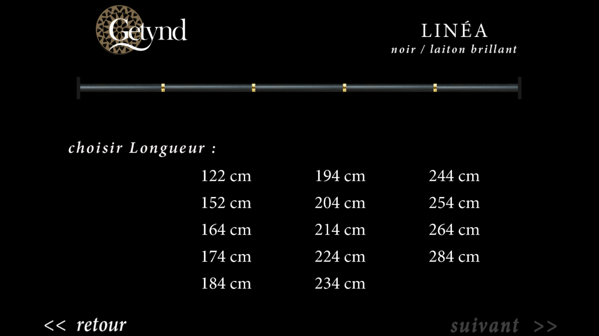
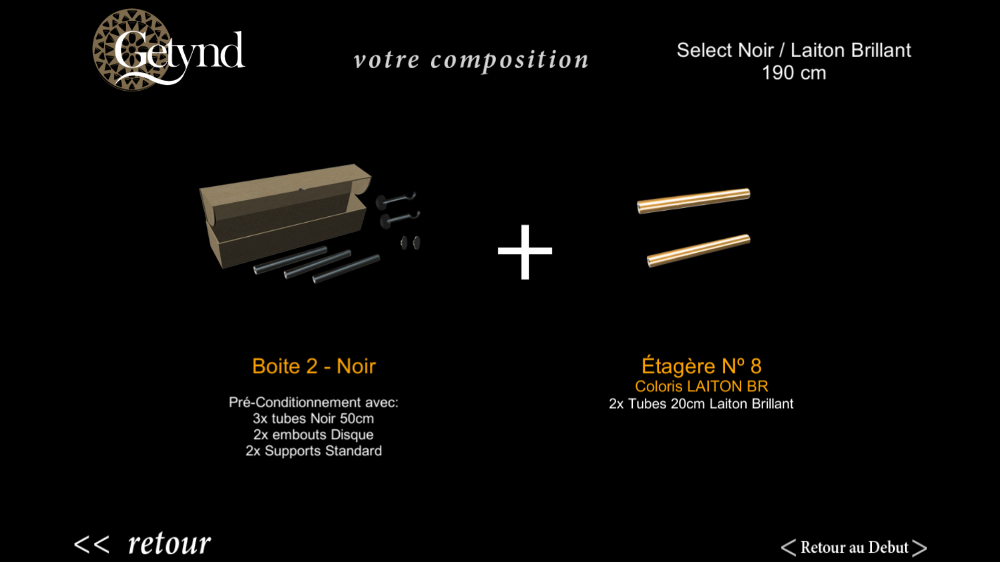

The first screen the user is greeted with is the collection selection screen.

*Select* and *Linea* each have 3 different main finish materials, while *Essenciel* has only one.

After choosing either *Select* or *Linea* the user is prompted to select one out of the three decorative materials available for the middle sections.
In the case of the *Essenciel* collection there is only 1 decorative material.

Decorative material selection screen of the *Select* collection, the main material is *Inox* and the selected decorative material is *Bronze*.

Decorative material selection screen of the *Linea* collection, the main material is *Noir* and the selected decorative material is *Laiton Brillant*.

Having chosen the decorative material the user must select a size for the curtain rod. Each of the 3 collections has different sets of available sizes. Bellow is the size sellection screen.

Having selected the size the user is then displayed the different products he needs to pick up as well as their location in the final screen.

