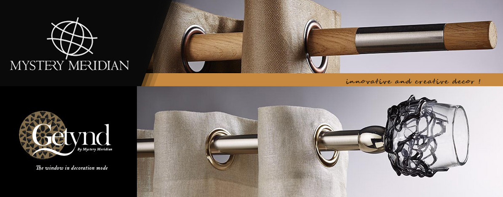

# Getynd Product Builder

#
Getynd Product Builder was developed for [Mystery Meridian](http://www.mysterymeridian.com/index_eng.html) as an in-store customer service application to serve as a product builder for it's [Getynd](https://www.getynd.com/en/) brand of curtain rods. It was deployed on Windows tablets at Mystery Meridian's section in the historic [Bazar de l'Hôtel de Ville](https://www.bhv.fr/), Paris. 

While I was responsible for the application's development in Unity3D, all the graphical assets as well as UI and UX design were the responsability of Mystery Meridian's employees.

#

### Running on Windows

The binary provided here was built as a Universal Windows Platform app, as that was what was needed for the project, so it will run on Windows platforms (pc, windows tablet etc) out of the box.

#

### Running on POSIX compliant systems

If you want to run this on a POSIX compliant system (GNU/Linux, MacOS, BSD, Solaris etc) then you can using [Wine](https://www.winehq.org/).

After installing Wine you will also need to install [winetricks](https://wiki.winehq.org/Winetricks) and then run the following command on your system's shell:

```bash
$ winetricks tahoma corefonts ie8
```

This installs the Windows fonts used by the application, if you don't run this command your wineprefix will not have the needed fonts and no text will be displayed when running the binary.

After completing these steps simply double-click the executable and Wine will do the rest.

#

### About Getynd Product Builder

Getynd Product Builder was created to allow customers to better visualize their options when choosing a Getynd product. Although Getynd has a vast array of different curtain rods only 3 subsets of Getynd products are featured in this application since those were the ones available for purchase at Bazar de l'Hôtel de Ville in Paris where this application was deployed.

The 3 subsets (or collections) featured are *Select*, *Linea* and *Essenciel*. Each has a main finish material which will be the material of the main curtain rod, and a decor material which is the material of the decorative middle sections. The user selects a collection, a main material, a decorative material and finally a size for the curtain rod. In the end the user is presented with the different parts he needs to pick up as well as their location.

For a more detailed look at the user's experience watch the [Getynd Product Builder demo](https://streamable.com/7d4b7a) or go [here](./detailed_description.md).
#

### About me

At the time of writing I am on the final year of my Bachelor's degree in Software Engineering at [Instituto Superior de Engenharia do Porto (ISEP)](https://www.isep.ipp.pt/), I developed this simple application, using Unity3D, part-time while on the second year of said degree.

#

### Contact Information

Contact me at renatofeghipereira5@gmail.com

Contact Mystery Meridian through their website at http://www.mysterymeridian.com/contact_pt.html or directly through mysterymeridian@gmail.com or +351 918 505 831

#

I have the right to showcase this application in binary form as per agreement with [Mystery Meridian](http://www.mysterymeridian.com/index_eng.html).

*© Mystery Meridian. All rights reserved. Getynd is a trademark of Mystery Meridian*

#
